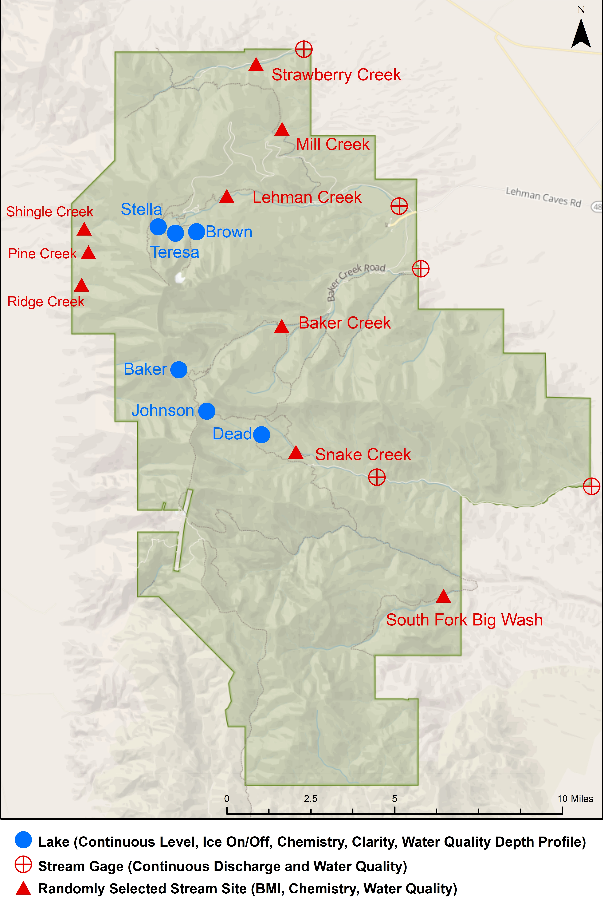

---
params:
  projectDir: "C:/Users/mlehman/Documents/R/mojn-stlk-drr"   # You will have to update this directory to match your project directory before knitting.
  reportNumber: ""                           # Optional. Only include this if publishing in the semi-official Data Release Report Series. Contact Joe if you are.
  reportRefID: 123456                                     # This should match the Data Store Reference ID for this report.
  packageAbstract: >-
    This report summarizes data quality evaluations of discrete data collected for the Mojave Desert Network Inventory and Monitoring Program (MOJN I&M) Streams and Lakes (STLK) monitoring protocol from 2009 to 2020. This protocol is designed to monitor the ecosystem health of nine streams and six subalpine lakes in Great Basin National Park (GRBA) and to identify and assess the effects of stressors such as climate change, groundwater withdrawal, and atmospheric nutrient deposition. Data collected include lake level surveys, water quality measurements, water chemistry samples, and benthic macroinvertebrate assemblages.
  dataPackage1RefID: 2287321                              # Data Store reference ID for data set associated with this report. You must have at least one.
  dataPackage1Title: "MOJN Streams and Lakes Data Package 2009-2020"               # Should match title in data store.
  dataPackage1Description: "MOJN STLK 2009-2020"  
  dataPackage2RefID: 2272464                              # Data Store reference ID for data set associated with this report. You must have at least one.
  dataPackage2Title: "Dataset 2 FULL TITLE"               # Should match title in data store.
  dataPackage2Description: "SHORT TITLE FOR DATASET 1"  
      
title: "Mojave Desert Network Streams and Lakes Data Package 2009-2020"
subtitle: |
  | Data Release Report `r params$reportNumber` 
author:
  - name: "Jennifer Bailard"                                      # Add or remove authors as appropriate.
    affiliation: |
      | Mojave Desert Network
      | Inventory and Monitoring Program 
      | 101 Katzenbach Drive
      | Boulder City, Nevada
  - name: "Mark Lehman"                                      # Add or remove authors as appropriate.
    affiliation: |
      | Mojave Desert Network
      | Inventory and Monitoring Program 
      | 101 Katzenbach Drive
      | Boulder City, Nevada
date: "`r format(Sys.time(), '%d %B, %Y')`"
abstract: "`r params$packageAbstract`"
editor_options:
  chunk_output_type: inline
csl: https://raw.githubusercontent.com/citation-style-language/styles/master/apa.csl
link-citations: yes
output:
  html_document:
    df_print: kable
    fig_caption: true
    dev: svg
    highlight: haddock
    keep_md: yes
    smart: no
    theme: journal
    css: "common/journalnps.min.css"
    toc: yes
    toc_float: true
    number_sections: true
    includes:
        before_body:
          - "common/header.html"
        after_body: 
          - "common/footer.html"
  word_document:
    df_print: kable
    fig_caption: yes
    fig_height: 5
    fig_width: 5
    highlight: haddock
    reference_docx: "common/DRR Word Template.docx"
---

```{r setup, include=FALSE}

# This setup code loads both reproducible reporting packages
# (delete those not needed) and packages for the actual project.
# Note that it also generates the start of a BibTex literature cited
# including the citations for R and all used packages

# reproducible reporting packages
RRpackages <- c('markdown',     # links to Sundown rendering library
                'rmarkdown',    # newer rendering via pandoc
                'pander',       # alternative renderer for markdown,
                                # plus better tables than just knitr
                'knitr',
                "dataMaid",     # for makeCodebooks
                "R.rsp",        # dynamic generation of scientific reports
                "kimisc",       #
                "papeR",        # stat tables
                "texreg",       # formatting regression results for LaTeX
                                # or html
                "rmdHelpers",   # misc from Mark Peterson
                                #  thisFileName() thisFile_knit()
                'yaml',         # format data into markdown
                'rmdformats',   # templates including automatic ToC,
                                # also use_bookdown()
                'htmltools',    #
                "bibtex",
                "RefManageR",   # BibTeX reference manager
                "knitcitations" #
                )

inst <- RRpackages %in% installed.packages()
if (length(RRpackages[!inst]) > 0) {
   install.packages(RRpackages[!inst], dep = TRUE, repos = "https://cloud.r-project.org")
}
lapply(RRpackages, library, character.only = TRUE)

# Now repeat for packages used in the analyses
pkgList <- c("devtools",        # tends to be needed/useful
             "RODBC",           # for connection to a database. 
             "EML",             # for data package creation and validation
             "kableExtra",      # added features for table formatting. 
             "english",         # converts numbers into english. Good for all that English stuff.
             "remotes",         # for install_github()
             "tidyverse",       # useful
             "magrittr",
             "plotly",
             "svglite",
             "scales",
             "streamsandlakes")

inst <- pkgList %in% installed.packages()
if (length(pkgList[!inst]) > 0) {
   install.packages(pkgList[!inst], dep = TRUE, 
                    repos = "https://cloud.r-project.org")
}

lapply(pkgList, library, character.only = TRUE, quietly = TRUE)

if (! "EMLassemblyline" %in% installed.packages()) remotes::install_github("EDIorg/EMLassemblyline")
require("EMLassemblyline")  

# create stub of citations for packages
pkgBibTex <- lapply(c("base", pkgList, RRpackages), citation)

# pkgBibTex <- do.call()

knitr::opts_chunk$set(
   root.dir = params$projectDir,  # from YAML parameter, knitr instead of setwd()
   echo = FALSE,
   comment = " ",
   dev = "svg",
   fig.path = "figures/",
   tidy.opts = list(width.cutoff = 60),
   tidy = TRUE
   )
# if ggplot, update theme to default to centered titles
if ("ggplot2" %in% .packages()) {
   theme_update(plot.title = element_text(hjust = 0.5))
}

setwd(params$projectDir)

# Write YAML parameters to file for consistent reuse across report and data packages
save(params,file="data/temp/reportParameters.RData")

conn <- OpenDatabaseConnection()
```

```{r LoadData, include=FALSE}
# Load datasets for use

if (file.exists(file="data/temp/projectMetadata.RData")) {
  load(file="data/temp/projectMetadata.RData")
} else{
  projectMetadata<-list()
}
```

<hr>
# Background & Introduction
## Significance
Streams and lakes in Great Basin National Park (GRBA) provide habitat for aquatic and terrestrial organisms, contribute to local water supplies, and serve as popular visitor destinations. Aquatic and riparian habitats are important compared to their relatively small land cover because they often host endemic biota and support higher levels of biodiversity. Up to 80% of all vertebrates in the western United States depend on riparian habitats for at least part of their life cycles, and more than half are completely dependent on riparian habitats. Recently, the regionally-endemic Bonneville cutthroat trout has been reintroduced to streams and lakes in the park.

## Threats and Stressors
Climate change poses the main threat to surface water resources in GRBA. Climate change affects precipitation and snowmelt patterns, which control stream flow regime--the amount and variability in discharge--as well as lake hydrology and physical limnology. Flow regime is the key driver of ecosystem processes in streams. In addition, climate change affects water temperatures and thermal regimes, which are also important determinants of biotic communities and ecosystem processes in streams and lakes.

Other potential threats include groundwater pumping in valleys adjacent to GRBA, cultural eutrophication, sedimentation, acid rain, input of contaminants, fishing, and the introduction of non-native species. Cultural eutrophication through the atmospheric deposition of anthropogenic nitrogen and phosphorus may lead to changes in food webs and fisheries and can exacerbate hypoxia events in lakes. Acid rain may decrease pH and alter the nutrient status of lakes. Lakes such as those at GRBA with low natural buffering capacity are particularly vulnerable to the effects of acidification. The combined effects of invasive grasses, past fire suppression, and climate change may result in large and catastrophic fires within the park. Large fires, particularly those burning entire watersheds, could be major disturbances for aquatic biota in streams and lakes.

## Sample Design
The Mojave Desert Network Inventory and Monitoring Program (MOJN I&M) monitors nine perennial streams and six subalpine lakes in GRBA as part of the Streams and Lakes protocol (Figure 1).

All nine streams are visited annually in August to collect water quality channel cross sections, water chemistry samples, and benthic macroinvertebrate samples. In addition, five permanent gaging stations on four of the streams are visited biweekly throughout the summer to calibrate sondes that record continuous water quality during the period of high flow. Four of these permanent gaging stations also have pressure transducers that record continuous stage, which is later converted to discharge through a rating curve.

The lakes are visited annually in September to collect water quality depth profiles, water chemistry samples, water clarity through Secchi depth measurements, and water surface elevations through digital level surveys. These water surface elevations are tied to continuous lake level recorded by pressure transducers.

``` {r figure1, echo = FALSE, fig.align = "left", fig.cap = "**Figure 1.** Streams and lakes monitoring locations, Great Basin National Park."}

```

## Monitoring Questions
The goal of this protocol is to gather information that will aid in the assessment, conservation, and restoration of these surface water resources. To achieve this goal, MOJN I&M collects data to address the following monitoring questions:

**Streams:**
1) Are the amount or seasonal patterns of discharge changing over time?
2) What is the status of and what are the trends in water chemistry?
3) What is the status of and what are the trends in benthic macroinvertebrate assemblages? 

**Lakes:**
1) Are water levels or the lake ice-free season changing over time?
2) What is the status of and what are the trends in water chemistry?

# Methods

## Data Collection and Sample Processing Methods
Field methods used are described in *Mojave Desert Network Inventory and Monitoring Streams and Lakes Protocol: Standard Operating Procedures and Supplementary Materials Version 1.0* (Natural Resource Report NPS/MOJN/NRR—2012/593.1), available here: https://irma.nps.gov/DataStore/Reference/Profile/2190896. Specific methods include SOP 6: Handheld Water Quality Instruments, SOP 7: Sample Handling, Storage, and Shipping, SOP 9: Stream Discharge, SOP 10: Lakes Field Procedures, SOP 11: Continuous Water Quality Sonde, and SOP 12: Stream Chemistry and BMI Sampling.

Water chemistry samples were analyzed by the Oregon State University Cooperative Chemical Analytical Laboratory (CCAL). Their laboratory methods can be found here: http://ccal.oregonstate.edu/sops, and their QA/QC measures can be found here: http://ccal.oregonstate.edu/qaqc.

Benthic macroinvertebrate samples were analyzed by the Utah State University BugLab. Their laboratory methods can be found here: https://www.usu.edu/buglab/SampleProcessing/LaboratoryProcedures/, and their QA/QC measures can be found here: https://www.usu.edu/buglab/SampleProcessing/QualityStandards/. These samples are stored by the BugLab at their facility in Logan, UT.

Summaries of these laboratory methods are also described in *Mojave Desert Network Inventory and Monitoring Streams and Lakes Protocol: Standard Operating Procedures and Supplementary Materials Version 1.0* (Natural Resource Report NPS/MOJN/NRR—2012/593.1), available here: https://irma.nps.gov/DataStore/Reference/Profile/2190896. Specific methods include SOP 13: Laboratory Analysis of BMI and SOP 14: Laboratory Analysis of Water Chemistry.

## Additional Data Sources
Provide descriptions (with citations) of other data sources used.
**Not applicable to this release.**

## Data Processing
Data were assessed using a collection of QC checks that are part of the MOJN Streams and Lakes R package. These results are summarized in Section 4 of this document. Where data quality issues exist, they have been documented in a flag note in the data record, and a flag has been assigned to indicate the level of concern. These flags include Information (not expected too impact the validity of this data), Warning (care should be taken when including this record in analyses), and Critical (There are serious concerns about the quality of this record and it should not be used in analyses).

## Code Availability
All of the code used in the preparation of this data package is available in the MOJN Streams and Lakes R Package <INSERT LINK>.

# Data Records
A data dictionary for all of the published tables and fields is provided in CSV format with this data package. 

The published CSV files are provided in a raw form for that is suitable for use with the MOJN Streams and Lakes R package. In three cases, a CSV file is provided that contains calculated values that were generated using this R package. These files are clearly labeled as "calculated".

One data package containing multiple csv data tables was published for this project:

* **`r params$dataPackage1Title`.** Comma-separated text files containing data from the MOJN Streams and Lakes protocol. These data were compiled by the Mojave Desert Inventory and Monitoring Network and were last updated on September 1, 2021. Available at `r paste0("https://irma.nps.gov/DataStore/Reference/Profile/", params$dataPackage1RefID)`. 

```{r Table1, echo=FALSE}
FileName<-c("Site","Visit","BMI","Channel","Chemistry","Clarity","LakeLevelString","LakeLevelSurvey","WaterQualityDO","WaterQualitypH","WaterQualitySpCond","WaterQualityTemperature","WQStreamXSection","LakeLevel_CALCULATED","WaterQuality_CALCULATED","WQStreamXSection_CALCULATED","Test")
Description<-c("A full description of each of the site codes used in this dataset (Streams and Lakes)","General attributes of the monitoring site visit (Streams and Lakes)","All benthic macroinvertebrate data from all sites (Streams)","Channel characteristics associated with the BMI measurements (Streams)","Laboratory analysis of water chemistry (Streams and Lakes)","Depth and secchi depth measurements (Lakes)","Lake level measured using a string-based survey","Lake level measured using a theodolite-based survey","Dissolved oxygen measured in situ through a depth profile (Lakes)","pH measured in situ through a depth profile (Lakes)","Specific conductance measured in situ through a depth profile (Lakes)","Temperature measured in situ through a depth profile (Lakes)","In situ water quality measured through stream crosssections (Streams)","The calculated lake surface level calculated from the raw data in LakeLevel String and LakeLevelSurvey using the MOJN Streams and Lakes R package (Lakes)","The median water quality values calculated from the four raw WaterQuality data tables (Lakes)","The median water quality values calculated from the raw values in the WQStreamXSection data table (Streams)")
Table<-data.frame(FileName,Description)

kable(Table, 
      col.names=c("FileName","Description"),
      caption="**Table 1.** Data files in this data package.") %>%
  kable_styling(bootstrap_options = c("striped", "hover", "condensed", "responsive"),full_width=F)

```

# Data Quality Evaluation

The data within the data records listed above have been reviewed by staff in the NPS Inventory and Monitoring Division to ensure accuracy, completeness, and consistency with documented data quality standards, as well as for usability and reproducibility. For additional information on data quality standards for this protocol, refer to *Mojave Desert Network Inventory and Monitoring Streams and Lakes Protocol: Standard Operating Procedures and Supplementary Materials Version 1.0* (Natural Resource Report NPS/MOJN/NRR—2012/593.1), available here: https://irma.nps.gov/DataStore/Reference/Profile/2190896. Specific methods include SOP 15: Quality Assurance Project Plan (QAPP) and SOP 16: Cumulative Measurement Bias.

## Advice and Caveats
- In 2009, Brown Lake and Dead Lake were not monitored as part of the pilot field season. 
- In 2009, no comparable lake level data were collected due to different reference marks used during the pilot field season. 
- In 2009, no channel characteristics or water quality cross-section data were collected at the streams as part of the pilot field season.
- In 2009, CCAL measured alkalinity as HCO3. From 2010 onward, CCAL measured alkalinity as CaCO3. The alkalinity values from 2009 were recalculated to match the more recent method.
- In 2009 and 2010, Baker Creek was monitored on the south fork (BAKR2). From 2011 onward, Baker Creek was monitored on the main stem (BAKR3).
- In 2013, Johnson Lake and Dead Lake were not monitored due to the lapse in federal appropriations.
- Due to an error in laboratory software programming, alkalinity values reported in 2014 and earlier that are less than 20 mg/L may be overestimated, with the discrepancy increasing closer to 0 mg/L.
- In 2015, no data were collected at Dead Lake because the lake was entirely dry.
- In 2016, no water chemistry data are available for Baker Creek because the wrong location was sampled accidentally.
- In 2017, no water quality data were collected at Baker Lake due to leaking waders. 
- In 2018, the method for determining benchmark and lake level elevations transitioned from string surveys to digit level surveys.

## Sites not visited {.tabset}
This is a list of sites that were not visited for annual monitoring during a field season. Stream sampling moved from Baker Creek South Fork (GRBA_S_BAKR2) to Baker Creek Main Stem (GRBA_S_BAKR3) in 2011. Brown Lake and Dead Lake were not monitored during the pilot field season in 2009. Dead Lake and Johnson Lake were not monitored in 2013 due to the lapse in federal appropriations. While Dead Lake was monitored in 2015, no data were collected because the lake was entirely dry.
``` {r no.visits}
no.visits <- qcNoAnnualVisit(conn)

no.visits %>%
  dplyr::select(-c(VisitDate, Park, SiteShort)) %>%
  DT::datatable()
```

## Data processing levels {.tabset}
This is a list of site visits that have any data categorized as "Raw" or "Provisional." These data need to be reviewed and moved to "Accepted" status before publication of the dataset.
``` {r dpl.check, echo = FALSE, message = FALSE}
dpl.check <- qcDPLCheck(conn)

dpl.check %>%
  DT::datatable()
```
`r if(nrow(dpl.check) == 0){"All records have been accepted."}`
`r if(nrow(dpl.check) > 0){"The above records need to be reviewed and accepted before publication."}`

## Lake surface and benchmark elevations {.tabset}
### Benchmark elevations
These are the mean values and standard deviations of final corrected elevations for each benchmark across all field seasons. Digital level readings began in 2018.
``` {r benchmark.elevations}
benchmark.elevations <- SurveyPointElevation(conn)

benchmark.elevations$ClosureError_ft <- round(benchmark.elevations$ClosureError_ft, 4)
benchmark.elevations$FinalCorrectedElevation_ft <- round(benchmark.elevations$FinalCorrectedElevation_ft, 4)

benchmark.elevations %>%
  dplyr::select(-c(Park, SiteShort, DPL, VisitType)) %>%
  DT::datatable(filter = "top")
```

### String survey heights
These are the mean values and standard deviations of string survey heights for each benchmark for each field season. The height of the benchmark above the water surface was typically measured seven times during the string survey. String surveys ended in 2018 and were replaced by digit level readings during that same field season, which have higher accuracy and precision. No comparable lake level data were collected in 2009 due to different reference marks used during the pilot field season.
``` {r string.heights}
string.heights <- qcStringSurveyHeights(conn)

string.heights$MeanHeight_ft <- round(string.heights$MeanHeight_ft, 4)
string.heights$StDevHeight_ft <- round(string.heights$StDevHeight_ft, 4)

string.heights %>%
  dplyr::select(-c(Park, SiteShort, VisitType)) %>%
  dplyr::ungroup() %>%
  DT::datatable(filter = "top")
```

### String survey elevations
These are the mean values and standard deviations of string survey lake level elevations for each field season. The reference mark designated Benchmark 1 was typically used to calculate the final lake level at each lake. String surveys ended in 2018 and were replaced by digit level readings during that same field season, which have higher accuracy and precision.
``` {r string.elevations}
string.elevations <- qcStringSurveyElevations(conn)

string.elevations$MeanFinalElevation_ft <- round(string.elevations$MeanFinalElevation_ft, 4)
string.elevations$StDevFinalElevation_ft <- round(string.elevations$StDevFinalElevation_ft, 4)

string.elevations %>%
  dplyr::select(-c(Park, SiteShort, VisitType)) %>%
  DT::datatable(filter = "top")
```

### Benchmark elevation plots
This is a plot of the final corrected elevations for each benchmark for each field season. Consistent upward or downward trends in the elevation of a benchmark may indicate that the benchmark is unstable. An abrupt change in the elevation of a benchmark may indicate disturbance at the location of the benchmark. Only digital level readings are included, which began in 2018.
``` {r benchmark.plots, warning = FALSE}
benchmark.plots <- PlotBenchmarkElevation(conn)

ggplotly(benchmark.plots)
```

### Lake surface elevations
These are the final calculated water surface elevations for each lake across all field seasons. Digital level readings began in 2018.
``` {r lake.elevations}
lake.elevations <- LakeSurfaceElevation(conn)

lake.elevations %>%
  dplyr::select(-c(Park, SiteShort, VisitType, DPL)) %>%
  DT::datatable(filter = "top")
  
```

### Lake surface elevation plots
This is a plot of the final calculated water surface elevations for each lake across all field seasons. Digital level readings began in 2018. Johnson Lake and Dead Lake were not visited in 2013 due to the lapse in federal appropriations. Dead Lake was dry in 2015.
``` {r lake.elev.plots, warning = FALSE}
lake.elev.plots <- PlotLakeSurfaceElevation(conn)

lake.elev.plots <- ggplotly(lake.elev.plots)


for (i in 1:length(lake.elev.plots$x$data)){
    if (!is.null(lake.elev.plots$x$data[[i]]$name)){
        lake.elev.plots$x$data[[i]]$name =  gsub("\\(","",str_split(lake.elev.plots$x$data[[i]]$name,",")[[1]][1])
    }
}

lake.elev.plots
```

## Lake water clarity (Secchi depth) {.tabset}
### Depths exceed lake
This is a list of records where Secchi depth measurements are greater than the lake depth entered during the visit.
``` {r depths.exceed.lake}
depths.exceed.lake <- qcSecchiGTDepth(conn)

depths.exceed.lake %>%
  dplyr::select(-c(Park, SiteShort, VisitType, DPL)) %>%
  DT::datatable(filter = "top")
```
There are `r nrow(depths.exceed.lake)` records with this inconsistency.

### Lake dry, depths exist
This is a list of records where the lake **is** dry and clarity data or Secchi depth measurements exist.
``` {r lake.dry.depths.exist}
lake.dry.depths.exist <- qcLakeDryMeasurementsExist(conn)

lake.dry.depths.exist %>%
  dplyr::select(-c(Park, SiteShort, VisitType, DPL)) %>%
  DT::datatable(filter = "top")
```
There are `r nrow(lake.dry.depths.exist)` records with this inconsistency.

### Lake not dry, no clarity
This is a list of records where the lake **is not** dry and calmness, on bottom, or depth to bottom data **do not** exist.
``` {r lake.not.dry.no.clarity}
lake.not.dry.no.clarity <- qcLakeNotDryMeasurementsMissing(conn)

lake.not.dry.no.clarity %>%
  dplyr::select(-c(Park, SiteShort, VisitType, DPL)) %>%
  DT::datatable(filter = "top")
```
There are `r nrow(lake.not.dry.no.clarity)` records with missing data.

### Lake not dry, no depths
This is a list of records where the Secchi disk **is not** visible on the bottom of the lake and Secchi depth measurements **do not** exist.
``` {r lake.not.dry.no.depths}
lake.not.dry.no.depths <- qcSecchiDepthMissing(conn)

lake.not.dry.no.depths %>%
  dplyr::select(-c(Park, SiteShort, VisitType, DPL)) %>%
  DT::datatable(filter = "top")
```
 There are `r nrow(lake.not.dry.no.depths)` records with missing data.

## Discrete water quality {.tabset}
### Stream sanity check
These are stream water quality values that fall above or below the ranges that we typically see in subalpine lake and stream systems. These data are not necessarily incorrect, but they are outliers that should be evaluated using data quality flags and field notes. Wildly impossible values may be the result of instrument malfunction, improper callibration, or typos during data entry. The following records are included in the list below: temperature values greater than 20 C, pH values greater than 10 and less than 6, specific conductance values greater than 1000 uS/cm, dissolved oxygen percent values greater than 110%, and dissolved oxygen concentration values greater than 12 mg/L.
``` {r wq.stream.sanity}
wq.stream.sanity <- qcStreamWqSanity(conn)

wq.stream.sanity %>%
  dplyr::select(-c(Park, SampleFrame, VisitType)) %>%
  dplyr::relocate(FieldSeason, .after = VisitDate) %>%
  DT::datatable(filter = "top")
```
There are `r nrow(wq.stream.sanity)` measurements outside of expected ranges.

### Lake sanity check
These are lake water quality values that fall above or below the ranges that we typically see in subalpine lake and stream systems. These data are not necessarily incorrect, but they are outliers that should be evaluated using data quality flags and field notes. Wildly impossible values may be the result of instrument malfunction, improper callibration, or typos during data entry. The following records are included in the list below: temperature values greater than 20 C, pH values greater than 10 and less than 6, specific conductance values greater than 1000 uS/cm, dissolved oxygen percent values greater than 110%, and dissolved oxygen concentration values greater than 12 mg/L.
``` {r wq.lake.sanity}
wq.lake.sanity <- qcLakeWqSanity(conn)

wq.lake.sanity %>%
  dplyr::select(-c(Park, SampleFrame, VisitType)) %>%
  dplyr::relocate(MeasurementDepth_m, .after = VisitDate) %>%
  dplyr::relocate(FieldSeason, .after = VisitDate) %>%
  DT::datatable(filter = "top")
```
There are `r nrow(wq.lake.sanity)` measurements outside of expected ranges.

### Stream data quality flags
These are stream water quality values that have data quality flags. I = Information: These data do not have any suspected problems, but there may be information regarding the equipment or conditions in which they were collected that could inform their interpretation. W = Warning: These data are suspected to have problems and should only be used after careful assessment of instrument and environmental factors. C = Critical: These data are suspected to have serious problems and are likely unusable.
``` {r wq.stream.flags}
wq.stream.flags <- qcStreamWqFlags(conn)

wq.stream.flags %>%
  dplyr::select(-c(Park, SampleFrame, VisitType)) %>%
  dplyr::relocate(FieldSeason, .after = VisitDate) %>%
  DT::datatable(filter = "top")
```
There are `r nrow(wq.stream.flags)` flagged measurements.

### Lake data quality flags
These are lake water quality values that have data quality flags. I = Information: These data do not have any suspected problems, but there may be information regarding the equipment or conditions in which they were collected that could inform their interpretation. W = Warning: These data are suspected to have problems and should only be used after careful assessment of instrument and environmental factors. C = Critical: These data are suspected to have serious problems and are likely unusable.
``` {r wq.lake.flags}
wq.lake.flags <- qcLakeWqFlags(conn)

wq.lake.flags %>%
  dplyr::select(-c(Park, SampleFrame, VisitType)) %>%
  dplyr::relocate(MeasurementDepth_m, .after = VisitDate) %>%
  dplyr::relocate(FieldSeason, .after = VisitDate) %>%
  DT::datatable(filter = "top")
```
There are `r nrow(wq.lake.flags)` flagged measurements.

### Lake temperature depth profiles
This is a plot of temperature depth profiles in units of C for each lake and field season. Depth profiles extend from the lake surface to the lake bottom at approximately the deepest part. Data flagged as "Warning" or "Critical" are not included. Johnson Lake and Dead Lake were not visited in 2013 due to the lapse in federal appropriations. Dead Lake was dry in 2015. Baker Lake water qualtiy data were not collected in 2017 due to leaky waders and frigid temperatures.
``` {r temp.dp.plot, warning = FALSE}
temp.dp.plot <- WqPlotTemperatureDepthProfile(conn)

ggplotly(temp.dp.plot)
```

### Lake pH depth profiles
This is a plot of pH depth profiles for each lake and field season. Depth profiles extend from the lake surface to the lake bottom at approximately the deepest part. Data flagged as "Warning" or "Critical" are not included. Johnson Lake and Dead Lake were not visited in 2013 due to the lapse in federal appropriations. Dead Lake was dry in 2015. Baker Lake water qualtiy data were not collected in 2017 due to leaky waders and frigid temperatures.
``` {r ph.dp.plot, warning = FALSE}
ph.dp.plot <- WqPlotPHDepthProfile(conn)

ggplotly(ph.dp.plot)
```

### Lake specific conductance depth profiles
This is a plot of specific conductance depth profiles in units of uS/cm for each lake and field season. Depth profiles extend from the lake surface to the lake bottom at approximately the deepest part. Data flagged as "Warning" or "Critical" are not included. Johnson Lake and Dead Lake were not visited in 2013 due to the lapse in federal appropriations. Dead Lake was dry in 2015. Baker Lake water qualtiy data were not collected in 2017 due to leaky waders and frigid temperatures.
``` {r sc.dp.plot, warning = FALSE}
sc.dp.plot <- WqPlotSpCondDepthProfile(conn)

ggplotly(sc.dp.plot)
```

### Lake dissolved oxygen depth profiles
This is a plot of dissolved oxygen depth profiles in units of mg/L for each lake and field season. Depth profiles extend from the lake surface to the lake bottom at approximately the deepest part. Data flagged as "Warning" or "Critical" are not included. Johnson Lake and Dead Lake were not visited in 2013 due to the lapse in federal appropriations. Dead Lake was dry in 2015. Baker Lake water qualtiy data were not collected in 2017 due to leaky waders and frigid temperatures.
``` {r do.dp.plot, warning = FALSE}
do.dp.plot <- WqPlotDODepthProfile(conn)

ggplotly(do.dp.plot)
```

## Water chemistry {.tabset}
### Data quality flags
These are water chemistry values that have data quality flags. I = Information: These data do not have any suspected problems, but there may be information regarding the equipment or conditions in which they were collected that could inform their interpretation. W = Warning: These data are suspected to have problems and should only be used after careful assessment of instrument and environmental factors. C = Critical: These data are suspected to have serious problems and are likely unusable.
``` {r chem.flags}
chem.flags <- qcChemFlags(conn)

chem.flags %>%
  dplyr::select(-c(SampleFrame)) %>%
  dplyr::relocate(FieldSeason, .after = VisitDate) %>%
  DT::datatable(filter = "top")
```
There are `r nrow(chem.flags)` flagged analytes.

### Lab duplicates
Laboratory duplicates and triplicates are re-analyses of an analyte from the same sample. These duplicates and triplicates can be used to confirm or replace a suspicious initial result. This is a list of the relative percent difference (RPD) values for laboratory duplicates and triplicates. Results that exceed the 30% method quality objective (MQO) threshold are flagged.
``` {r lab.dupes}
lab.dupes <- qcChemLabDupes(conn)

lab.dupes %>%
  dplyr::select(-c(SampleFrame)) %>%
  dplyr::relocate(FieldSeason, .after = VisitDate) %>%
  DT::datatable(filter = "top")
```
There are `r nrow(lab.dupes %>% filter(RPD > 30))` duplicates with RPD values above the 30% MQO threshold.

### Field duplicates
Field duplicates are additional samples collected from the same location at approximately the same time and using the same methods as the primary sample. These duplicates can help to detect inconsistency in collection methods or variability in water chemistry at a location. This is a list of the relative percent difference (RPD) values for field duplicates and triplicates. Results that exceed the 30% method quality objective (MQO) threshold are flagged.
``` {r field.dupes}
field.dupes <- qcChemFieldDupes(conn)

field.dupes %>%
  dplyr::select(-c(SampleFrame)) %>%
  dplyr::relocate(FieldSeason, .after = VisitDate) %>%
  DT::datatable(filter = "top")
```
There are `r nrow(field.dupes %>% filter(RPD > 30))` duplicates with RPD values above the 30% MQO threshold.

### Field blanks
Field blanks are bottles filled with distilled water as opposed to water sampled at the location. They are handled the same way as primary samples in the field and can help to detect and identify sources of contamination during sampling. This is a list of analyte concentrations that exceed the method detection limit (MDL) for that analyte.
``` {r field.blanks}
field.blanks <- qcChemFieldBlanks(conn)

field.blanks %>%
  dplyr::select(-c(SampleFrame)) %>%
  dplyr::relocate(FieldSeason, .after = VisitDate) %>%
  DT::datatable(filter = "top")
```
There are `r nrow(field.blanks)` analytes from blanks with concentrations greater than the MDL for that analyte.

### Dissolved nitrogen
These are the records where the concentration of total dissolved nitrogen (TDN) exceeds total nitrogen (UTN). If the discrepancy falls within precision limits, this indicates that nearly all of the nitrogen is dissolved, and the two concentrations are essentially equal to each other. If the discrepancy falls outside of precision limits, this may indicate contamination of the sample. Alternatively, this may be a consequence of the natural heterogeneity of the water body. The total nutrient concentration is measured from the unfiltered sample, while the dissolved nutrient concentration is measured from the filtered sampled. These two samples are collected at approximately the same time and location, but there may be some variability that becomes more evident at low concentrations.
``` {r chem.TDN}
chem.TDN <- qcChemTDN(conn)

chem.TDN %>%
  dplyr::select(-c(SampleFrame)) %>%
  dplyr::relocate(FieldSeason, .after = VisitDate) %>%
  DT::datatable(filter = "top")
```
There are `r nrow(chem.TDN %>% filter(TDNvUTN >= 0.02))` records where the concentration of dissolved nitrogen is greater than the total nitrogen concentration and the difference is outside the normal limits of variability.

### Nitrate and nitrite
These are the records where the concentration of nitrate (NO3) and nitrite (NO2) exceeds either total nitrogen (UTN) or total dissolved nitrogen (TDN). If the discrepancy falls within precision limits, this indicates that nearly all of the nitrogen or dissolved nitrogen is in the form of nitrate and nitrite, and the two concentrations are essentially equal to each other. If the discrepancy falls outside of precision limits, this may indicate contamination of the sample. Alternatively, this may be a consequence of the natural heterogeneity of the water body. The total nutrient concentration is measured from the unfiltered sample, while the dissolved nutrient concentration (including nitrate and nitrite) is measured from the filtered sampled. These two samples are collected at approximately the same time and location, but there may be some variability that becomes more evident at low concentrations.
``` {r chem.NO3NO2}
chem.NO3NO2 <- qcChemNO3NO2(conn)

chem.NO3NO2 %>%
  dplyr::select(-c(SampleFrame)) %>%
  dplyr::relocate(FieldSeason, .after = VisitDate) %>%
  DT::datatable(filter = "top")
```
There are `r nrow(chem.NO3NO2)` records where the concentration of nitrate and nitrate is greater than the concentration of either total nitrogen or total dissolved nitrogen.

### Dissolved phosphorus
These are the records where the concentration of total dissolved phosphorus exceeds total phosphorus. If the discrepancy falls within precision limits, this indicates that nearly all of the phosphorus is dissolved, and the two concentrations are essentially equal to each other. If the discrepancy falls outside of precision limits, this may indicate contamination of the sample. Alternatively, this may be a consequence of the natural heterogeneity of the water body. The total nutrient concentration is measured from the unfiltered sample, while the dissolved nutrient concentration is measured from the filtered sampled. These two samples are collected at approximately the same time and location, but there may be some variability that becomes more evident at low concentrations.
``` {r chem.TDP}
chem.TDP <- qcChemTDP(conn)

chem.TDP %>%
  dplyr::select(-c(SampleFrame)) %>%
  dplyr::relocate(FieldSeason, .after = VisitDate) %>%
  DT::datatable(filter = "top")
```
There are `r nrow(chem.TDP %>% filter(TDPvUTP >= 0.003))` records where the concentration of dissolved phosphorus is greater than the total phosphorus concentration and the difference is outside the normal limits of variability.

### MDL
Minimum detection level (MDL) is defined by the EPA as the "minimum concentration of a substance that can be measured and reported with 99% confidence that the analyte concentration is greater than zero." Below this concentration, presence of the analyte cannot be confirmed. These are the records where the concentration of a certain analyte was less than or equal to the MDL for that analyte.
``` {r chem.MDL}
lookup <- getMDLLookup()
chem.MDL <- qcChemMDL(conn)

chem.MDL %>%
  dplyr::select(-c(SampleFrame)) %>%
  dplyr::relocate(FieldSeason, .after = VisitDate) %>%
  DT::datatable(filter = "top")
```
There are `r nrow(chem.MDL)` analytes with concentrations less than or equal to the MDL.

### ML
Minimum level of quantification (ML) is defined as the "concentration at which the analytical system gives a recognizable signal and acceptable calibration point for the analyte." Below this concentration, the analyte may be detected (if greater than the MDL) but not measured at a known level of confidence. These are the records where the concentration of a certain analyte was less than or equal to the ML for that analyte.
``` {r chem.ML}
lookup <- getMDLLookup()
chem.ML <- qcChemML(conn)

chem.ML %>%
  dplyr::select(-c(SampleFrame)) %>%
  dplyr::relocate(FieldSeason, .after = VisitDate) %>%
  DT::datatable(filter = "top")
```
There are `r nrow(chem.ML)` analytes with concentrations less than or equal to the ML.

### Stream nutrients plot
This is a plot of nutrient concentrations for each stream for each field season. Nutrient concentrations include total nitrogen (UTN), total dissolved nitrogen (TDN), nitrate and nitrite as nitrogen (NO3NO2-N), total phosphorus (UTP), and total dissolved phosphorus (TDP). Dissolved organic carbon (DOC) is analyzed occasionally as funding allows.
``` {r chem.stream.nutrient.plot, warning = FALSE}
chem.stream.nutrient.plot <- ChemStreamNutrientPlot(conn)

ggplotly(chem.stream.nutrient.plot)
```

### Stream nutrients bar plot
This is a bar plot of nutrient concentrations for each stream for each field season. Nutrient concentrations include total nitrogen (UTN), total dissolved nitrogen (TDN), nitrate and nitrite as nitrogen (NO3NO2-N), total phosphorus (UTP), and total dissolved phosphorus (TDP). Total and dissolved concentrations are plotted on the same graph to show the relative contributions from each form.
``` {r chem.stream.nutrient.bar.plot, warning = FALSE}
chem.stream.nutrient.bar.plot <- ChemStreamNutrientBarPlot(conn)

ggplotly(chem.stream.nutrient.bar.plot)
```

### Stream ions plot
This is a plot of ion concentrations for each stream for each field season. Ion concentrations include sodium (Na), magnesium (Mg), potassium (K), calcium (Ca), sulfate as sulfur (SO4-S), and chloride (Cl). Alkalinity (ALK2) is also analyzed.

Alkalinity is a property of water defined by the USGS as "the buffering capacity of a water body; a measure of the ability of the water body to neutralize acids and bases and thus maintain a fairly stable pH level." As alkalinity decreases, the sensitivity of a water body to acidification increases. Alkalinity is expressed as mg-CaCO3/L. In 2009, the laboratory measured alkalinity as HCO3. From 2010 to the present, the laboratory measured alkalinity as CaCO3. The alkalinity values from 2009 were recalculated to match the method from 2010 onward. Due to an error in laboratory software programming, ALK2 values analyzed in 2014 and earlier that are less than 20 mg/L may be overestimated (typically 1.5 to 2.5 mg/L, up to 35% difference), with the discrepancy increasing closer to 0 mg/L.
``` {r chem.stream.ion.plot, warning = FALSE}
chem.stream.ion.plot <- ChemStreamIonPlot(conn)

ggplotly(chem.stream.ion.plot)
```

### Lake nutrients plot
This is a plot of nutrient concentrations for each lake for each field season. Nutrient concentrations include total nitrogen (UTN), total dissolved nitrogen (TDN), nitrate and nitrite as nitrogen (NO3NO2-N), total phosphorus (UTP), and total dissolved phosphorus (TDP). Dissolved organic carbon (DOC) is analyzed occasionally as funding allows.
``` {r chem.lake.nutrient.plot, warning = FALSE}
chem.lake.nutrient.plot <- ChemLakeNutrientPlot(conn)

ggplotly(chem.lake.nutrient.plot)
```

### Lake nutrients bar plot
This is a bar plot of nutrient concentrations for each lake for each field season. Nutrient concentrations include total nitrogen (UTN), total dissolved nitrogen (TDN), nitrate and nitrite as nitrogen (NO3NO2-N), total phosphorus (UTP), and total dissolved phosphorus (TDP). Total and dissolved concentrations are plotted on the same graph to show the relative contributions from each form.
``` {r chem.lake.nutrient.bar.plot, warning = FALSE}
chem.lake.nutrient.bar.plot <- ChemLakeNutrientBarPlot(conn)

ggplotly(chem.lake.nutrient.bar.plot)
```

### Lake ions plot
This is a plot of ion concentrations for each lake for each field season. Ion concentrations include sodium (Na), magnesium (Mg), potassium (K), calcium (Ca), sulfate as sulfur (SO4-S), and chloride (Cl). Alkalinity (ALK2) is also analyzed.

Alkalinity is a property of water defined by the USGS as "the buffering capacity of a water body; a measure of the ability of the water body to neutralize acids and bases and thus maintain a fairly stable pH level." As alkalinity decreases, the sensitivity of a water body to acidification increases. Alkalinity is expressed as mg-CaCO3/L. In 2009, the laboratory measured alkalinity as HCO3. From 2010 to the present, the laboratory measured alkalinity as CaCO3. The alkalinity values from 2009 were recalculated to match the method from 2010 onward. Due to an error in laboratory software programming, ALK2 values analyzed in 2014 and earlier that are less than 20 mg/L may be overestimated (typically 1.5 to 2.5 mg/L, up to 35% difference), with the discrepancy increasing closer to 0 mg/L.
``` {r chem.lake.ion.plot, warning = FALSE}
chem.lake.ion.plot <- ChemLakeIonPlot(conn)

ggplotly(chem.lake.ion.plot)
```

## Benthic macroinvertebrates {.tabset}
### Discrepancies
These are stream BMI records with discrepancies between taxa group count (or richness; number of taxa within a group) and taxa group abundance (number of individuals per m2 within a group). Discrepancies include situations where the taxa count is non-zero but abundance is zero and where abundance is non-zero and taxa count is zero. These situations may arise from the standardization of richness-based (taxa group count) metrics to Operational Taxonomic Units (OTUs), while density-based (taxa group abundance) metrics are based on the raw taxa list.
``` {r bmi.discrepancies}
bmi.discrepancies <- qcBMIDiscrepancies(conn)

bmi.discrepancies %>%
  dplyr::select(-c(Park, SiteShort, VisitType)) %>%
  dplyr::relocate(FieldSeason, .after = VisitDate) %>%
  DT::datatable(filter = "top")
```
There are `r nrow(bmi.discrepancies)` metrics with discrepancies between taxa group count and taxa group abundance.

### General metrics plot
This plot shows total richness (number of unique taxa within a sample) and total abundance (number of individuals per m2 within a sample) for stream BMI samples. Richness metrics are standardized to Operational Taxonomic Units (OTUs), which abundance metrics are based on the raw taxa list.
``` {r bmi.gen.plot, warning = FALSE}
bmi.gen.plot <- BMIGeneralMetricsPlot(conn)

ggplotly(bmi.gen.plot)
```

### Diversity metrics plot
This plot shows various diversity metrics and indices for stream BMI samples. Shannon's Diversity is the measure of richness and evenness (based on relative abundance of each species) weighted toward rare species. Simpson's Diversity is the measure of richness and evenness (based on relative abundance of each species) weighted toward common species. Evenness is the measure of relative abundance indicative of taxa dominance. The Hilsenhoff Biotic Index (HBI) is the abundance-weighted average of family-level pollution tolerances.
``` {r bmi.div.plot, warning = FALSE}
bmi.div.plot <- BMIDiversityMetricsPlot(conn)

ggplotly(bmi.div.plot)
```

### Tolerance metrics plot
This plot shows richness (number of taxa within a group) and abundance (number of individuals within a group) for stream BMI samples. Richness metrics are standardized to Operational Taxonomic Units (OTUs), which abundance metrics are based on the raw taxa list.

Groups are based on tolerance to disturbance or pollution. The Hilsenhoff Biotic Index (HBI) is the abundance-weighted average of family-level pollution tolerances, and is plotted in the diversity metrics section. Tolerant taxa have an HBI score >=8 and are able to withstand disturbance and poor water quality. Intolerant taxa have an BMI score <=2 and are not as able to withstand disturbance and poor water quality. EPT refers to the insect orders Ephemeroptera (mayflies), Plecoptera (stoneflies), and Tricoptera (caddisflies), which are sensitive to disturbance and can indicate good water quality. Long-lived taxa have 2- to 3-year life cycles can indicate habitat stability and persistent good water quality in their habitat. Clinger taxa have fixed retreats or other strategies for clinging to rocks and are vulnerable to the deposition of fine sediments.
``` {r bmi.tol.plot, warning = FALSE}
bmi.tol.plot <- BMIToleranceMetricsPlot(conn)

ggplotly(bmi.tol.plot)
```

### Functional feeding group metrics plot
This plot shows richness (number of taxa within a group) and abundance (number of individuals within a group) for stream BMI samples. Richness metrics are standardized to Operational Taxonomic Units (OTUs), which abundance metrics are based on the raw taxa list.

Groups are based on functional feeding groups, which refer to the type of food resource that species utilize in the stream. Shredder taxa consume living or decomposing vascular plant tissue and coarse particulate organic matter (CPOM). Scraper taxa consume periphyton, particularly algae and diatoms. Collector-filterer taxa consume fine particulate organic matter (FPOM) in the water column. Collector-gatherer taxa consume FPOM from benthic deposits. Predator taxa consume living animal tissue, usually other BMI, but occasionally small amphibians and other vertebrates. They can indicate that a habitat supports higher trophic complexity.
``` {r bmi.fun.plot, warning = FALSE}
bmi.fun.plot <- BMIFunctionalMetricsPlot(conn)

ggplotly(bmi.fun.plot)
```

### Taxonomic metrics plot
This plot shows richness (number of taxa within a group) and abundance (number of individuals within a group) for stream BMI samples. Richness metrics are standardized to Operational Taxonomic Units (OTUs), which abundance metrics are based on the raw taxa list.

Groups are based on taxonomic levels. Insecta is a class of six-legged invertebrates within the arthropod phylum. Coleoptera is an order of insects that includes beetles. Diptera is an order of insects that includes flies and midges. Megaloptera is an order of insects that includes dobsonflies. Plecoptera is an order of insects that includes stoneflies. Chironomidae is a family within Diptera that includes non-biting midges. Elmidae is a family within Coleoptera that includes riffle beetles. Non-insects include all individuals not within the class Insecta. Mollusca is a phylum that includes gastropods (e.g., snails and slugs), cephalopods (e.g., octopus and squids), and bivalves (e.g., clams). Crustacea is another class of invertebrates within the arthropod phylum that includes crabs, lobsters, crayfish, barnacles, and copepods. Oligochaeta is is a subclass of segmented worms within the annelid phylum that includes earthworms.

``` {r bmi.tax.plot, warning = FALSE}
bmi.tax.plot <- BMITaxonomicMetricsPlot(conn)

ggplotly(bmi.tax.plot)
```

# Usage Notes (required)
The Usage Notes should contain brief instructions to assist other researchers
with reuse of the data. This may include discussion of software packages that
are suitable for analysing the assay data files, suggested downstream processing
steps (e.g. normalization, etc.), or tips for integrating or comparing the data
records with other datasets. Authors are encouraged to provide code, programs or
data-processing workflows if they may help others understand or use the data.

For studies involving privacy or safety controls on public access to the data,
this section should describe in detail these controls, including how authors can
apply to access the data, what criteria will be used to determine who may access
the data, and any limitations on data use.

# Acknowledgements
The authors would like to acknowledge Geoff Moret, who wrote the Streams and Lakes protocol and set in motion over a decade of surface water resource monitoring in Great Basin National Park.

# References (required)
Bibliographic information for any works cited in the above sections, using the
standard *NPS NR Publication Series* referencing style.

In line with emerging [industry-wide standards for data
citation](https://www.nature.com/articles/sdata2018259), references to all
datasets described or used in the manuscript should be cited in the text and
listed in the ‘References’ section in the same manner as a conventional
literature reference.

ITIS. 2020. Integrated Taxonomic Information System. Available at: https://www.itis.gov/ (accessed 29 January 2020).

National Park Service (NPS). 2010. Draft Reference Manual RM 66B: Handling Protected Information. National Park Service, Washington, DC. (Available at https://irma.nps.gov/DataStore/Reference/Profile/2224216)

National Park Service (NPS). 2019. NPSpecies - the National Park Service biodiversity database. Available at: https://irma.nps.gov/NPSpecies/ (accessed xx).

Office of Management and Budget (OMB). 2013. Open Data Policy-Managing Information as an Asset. Office of Management and Budget. (Available at https://digital.gov/open-data-policy-m-13-13/)

U.S. Fish & Wildlife Service (USFWS). 2019. ECOS Environmental Conservation Online System. Available at: https://ecos.fws.gov/ecp/ (accessed xx).

U.S. Government Printing Office (GPO). 2013. Making Open and Machine Readable the New Default for Government Information. Executive Order 13642.(Available at https://www.govinfo.gov/content/pkg/CFR-2014-title3-vol1/pdf/CFR-2014-title3-vol1-eo13642.pdf)


\pagebreak

# Appendix C. Code Listing
```{r Listing, ref.label=knitr::all_labels(), echo=TRUE, eval=FALSE}
```

\pagebreak

# Appendix D. Session and Version Information
```{r session-info, echo=FALSE, cache=FALSE}
sessionInfo()
Sys.time()
```

# Additional Notes (this should not be included in reports...)

## Figures

Figure images should be included in-text near the initial point of reference.

Figure captions begin with a brief title sentence summarizing the purpose of the figure as a whole, and continue with a short description of what is shown in each panel and an explanation of any symbols used. Legends must total no more than 350 words, and may contain literature references. The first sentence of the legend will be used as the title for the figure. It (the first sentence) should contain no references of any kind, including to specific figure panels, bibliographic citations or references to other figures or panels.

## Tables

Authors are encouraged to provide one or more tables that provide basic
information on the main ‘inputs’ to the study (e.g. samples, participants, or
information sources) and the main data outputs of the study; also see the
additional information on providing metadata on page 6. Tables in the manuscript
should generally not be used to present primary data (i.e. measurements). Tables
containing primary data should be submitted to an appropriate data repository.

Authors may provide tables within text near the initial citation or as an
appendix. Legends, where needed, should be included in the Word document.
Generally, a Data Publication Report should have fewer than ten tables, but more
may be allowed when needed.

### Example Data Record Summary Tables
Here, we provide four generic ‘Table 1’ examples, including two experimental
study examples, one observational study example, and an example for an
aggregated dataset of the type that may result from a meta-analysis. 

```{r Table21, echo=FALSE}
T1Subjects<-c("Mouse1","Mouse2","Mousen")
T1Protocol1<-c("Drug treatment","Drug treatment","Drug treatment")
T1Protocol2<-c("Liver dissection","Liver dissection","Liver dissection")
T1Protocol3<-c("RNA extraction","RNA extraction","RNA extraction")
T1Protocol4<-c("RNA-Seq","RNA-Seq","RNA-Seq")
T1Data<-c("GEOXXXXX","GEOXXXXX","GEOXXXXX")
Table1<-data.frame(T1Subjects,T1Protocol1,T1Protocol2,T1Protocol3,T1Protocol4,T1Data)

kable(Table1, 
      col.names=c("Subjects","Protocol 1","Protocol 2","Protocol 3","Protocol 4","Data"),
      caption="**Table 21.** Experimental study example Data Records table.") %>%
  kable_styling(bootstrap_options = c("striped", "hover", "condensed", "responsive"),full_width=F) %>%
  footnote(general="This table was generated using the kableExtra package.")

```

```{r Table2, echo=FALSE}
Source<-c("CellCulture1","CellCulture1","CellCulture1","CellCulture1","CellCulture1","CellCulture1")
Protocol1<-c("Drug treatment","Drug treatment","Drug treatment","Drug treatment","Drug treatment","Drug treatment")
Protocol2<-c("RNA extraction","RNA extraction","RNA extraction","RNA extraction","RNA extraction","RNA extraction")
Samples<-c("TechnicalRep1a","TechnicalRep2a","TechnicalRep3a","TechnicalRep1b","TechnicalRep2b","TechnicalRep3b")
Protocol3<-c("Microarray hybridization","Microarray hybridization","Microarray hybridization","Microarray hybridization","Microarray hybridization","Microarray hybridization")
Data<-c("GEOXXXXX","GEOXXXXX","GEOXXXXX","GEOXXXXX","GEOXXXXX","GEOXXXXX")
Table<-data.frame(Source,Protocol1,Protocol2,Samples,Protocol3,Data)

kable(Table, 
      col.names=c("Subjects","Protocol 1","Protocol 2","Samples","Protocol 3","Data"),
      caption="**Table 2.** Experimental study with replicates Data Records table.") %>%
  kable_styling(bootstrap_options = c("striped", "hover", "condensed", "responsive"),full_width=F)


```

```{r Table3, echo=FALSE}
Sample<-c("Body of water 1","Body of water 2","Body of water n")
geoloc<-c("location name","location name","location name")
geopos<-c("latitude, longitude, altitude","latitude, longitude, altitude","latitude, longitude, altitude")
protocol<-c("Measurement of surface temperature","Measurement of surface temperature","Measurement of surface temperature")
data<-c("dataFile1","dataFile2","dataFile3")
Table<-data.frame(Sample,geoloc,geopos,protocol,data)

kable(Table, 
      col.names=c("Sample","Geographical Location","Geoposition","Protocol","Data"),
      caption="**Table 3.** Observational study example Data Records table.") %>%
  kable_styling(bootstrap_options = c("striped", "hover", "condensed", "responsive"),full_width=F)


```

```{r Table4, echo=FALSE}
c1<-c("Database URL 1","Database URL 1","Database URL 2")
c2<-c("Dataset 1","Dataset 2","Dataset n")
c3<-c("Number of samples in the dataset","Number of samples in the dataset","Number of samples in the dataset")
c4<-c("Range of measurements reported in the dataset","Range of measurements reported in the dataset","Range of measurements reported in the dataset")
c5<-c("Data assimilation procedure","Data assimilation procedure","Data assimilation procedure")
c6<-c("Method to generate output data","Method to generate output data","Method to generate output data")
c7<-c("dataFile1","dataFile1","dataFile2")
Table<-data.frame(c1,c2,c3,c4,c5,c6,c7)

kable(Table, 
      col.names=c("Source","Sample","Sample Number","Temporal Range","Protocol 1","Protocol2","Data"),
      caption="**Table 4.** Data aggregation study example Data Records table.") %>%
  kable_styling(bootstrap_options = c("striped", "hover", "condensed", "responsive"),full_width=F)


```

``` {r close.db}
CloseDatabaseConnection(conn)
```
